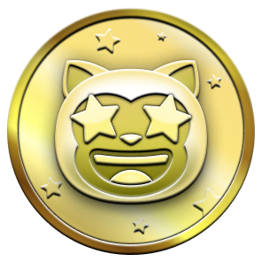

# 🏆 GitHub Achievement Badges

A collection of GitHub achievement badges and quick reference guide.

**⭐ Please star this repository if you find it helpful!**

## 📖 Complete Guide

For detailed instructions on how to unlock each badge, visit my blog post:
**[📝 How to Get All GitHub Achievement Badges](https://your-website.com/your-blog-post)**

## 🏅 All GitHub Achievement Badges

| Badge | Name | Description |
|-------|------|-------------|
|  | **Quickdraw** | Close issue/PR within 5 minutes |
|  | **Pair Extraordinaire** | Coauthor commits on merged PR |
|  | **Starstruck** | Create repository with many stars |
|  | **Galaxy Brain** | Answer discussion with accepted answer |
|  | **Pull Shark** | Open merged pull requests |
|  | **YOLO** | Merge PR without code review |
|  | **Heart On Your Sleeve** | React with ❤️ emoji |
|  | **Open Sourcerer** | Merge PRs in multiple public repos |
|  | **Arctic Code Vault Contributor** | Contributed code archived in Arctic Code Vault |
|  | **Mars 2020 Contributor** | Contributed to Mars 2020 Helicopter Mission |
|  | **Public Sponsor** | Sponsor open source projects publicly |

## 🎖️ Badge Tiers

Most achievements come in different tiers based on your activity level:
* 🥉 **Bronze**: Basic level achievement
* 🥈 **Silver**: Intermediate level achievement  
* 🥇 **Gold**: Advanced level achievement

### Example Tier Progression
| Bronze | Silver | Gold |
|--------|--------|------|
|  |  |  |
| 16+ stars | 128+ stars | 1024+ stars |

## 🌟 Support This Project

If this helped you get GitHub badges:
- ⭐ **Star this repository**
- 🔗 **Share with other developers**
- 📝 **Read the full guide on my blog**

---

**Made with ❤️ for the GitHub community**